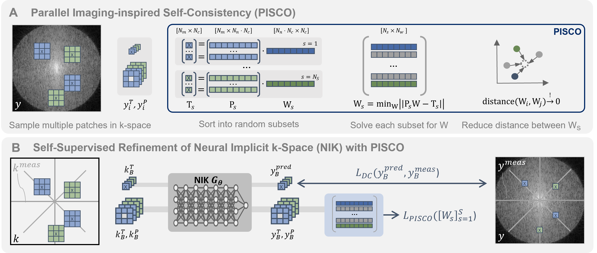

# Self-Supervised k-Space Regularization for Motion-Resolved Abdominal MRI Using Neural Implicit k-Space Representations

**Veronika Spieker**, Hannah Eichhorn, Jonathan K. Stelter, Wenqi Huang, Rickmer F. Braren, Daniel Rückert, Francisco Sahli Costabal, Kerstin Hammernik, Claudia Prieto, Dimitrios C. Karampinos, Julia A. Schnabel

Accepted at [MICCAI 2024](https://conferences.miccai.org/2024/) | [preprint](https://arxiv.org/abs/2404.08350)



(A) Overview of proposed concept of parallel imaging-inspired self-consistency (PISCO).
(B) Inclusion of PISCO in the training of neural implicit k-space representations (NIK).

**Abstract:** 
Neural implicit k-space representations have shown promising results for dynamic MRI at high temporal resolutions. 
Yet, their exclusive training in k-space limits the application of common image regularization methods to improve the 
final reconstruction. In this work, we introduce the concept of parallel imaging-inspired self-consistency (PISCO), 
which we incorporate as novel self-supervised k-space regularization enforcing a consistent neighborhood relationship. 
At no additional data cost, the proposed regularization significantly improves neural implicit k-space reconstructions 
on simulated data. Abdominal in-vivo reconstructions using PISCO result in enhanced spatio-temporal image quality 
compared to state-of-the-art methods.

**Keywords:** Dynamic MRI Reconstruction · Parallel Imaging · k-Space
Refinement · Self-Supervised Learning · Implicit Neural Representations


## Citation
If you use this code, please cite our arXiv paper:

```
@misc{Spieker_2024_arxiv,
 title = {Self-Supervised k-Space Regularization for Motion-Resolved Abdominal MRI Using Neural Implicit k-Space Representations},
 author = {Spieker, Veronika and Eichhorn, Hannah and Stelter, Jonathan K. and Huang, Wenqi and Braren, Rickmer F. and Rueckert, Daniel and Costabal, Francisco Sahli and Hammernik, Kerstin and Prieto, Claudia and Karampinos, Dimitrios C. and Schnabel, Julia A.},
 year={2024},
 eprint={2404.08350},
 archivePrefix={arXiv},
}
```

## Content:
- `train_sos_kreg.py/`: Training script for NIK using self-supervised k-space regularization
- `test_kreg_with_ref.py`: Testing script that runs evaluation of the predicted reconstruction to the reference reconstruction (path needs to be given)
- `config/`: Configuration files for 
  - `config/kreg/...` experiments and model setup
  - `config/subject/...` subjects and data paths
- `datasets/`: Data loading and preprocessing
- `models/`: Model architectures
- `utils/`: Helper functions
- `losses/`: Loss functions including the **proposed self-supervised k-space regularization PISCO** (`losses/pisco.py`)

## Setup:

1. Create a virtual environment with the required packages:
    ```
    conda env create -f env_nik_mri_clean2.yml
    source activate nik_mri_clean2 *or* conda activate nik_mri_clean2
    ```
2. Install pytorch with cuda: 
    ```
    conda install pytorch torchvision torchaudio pytorch-cuda=11.7 -c pytorch -c nvidia
    pip install torchinfo
    conda install -c conda-forge pytorch-lightning
    ```
3. For setting up wandb please refer to the [IML-CompAI Framework](https://github.com/compai-lab/iml-dl).


## Training:

1. Adapt config files to your needs:
   1. For experiment setup: `config/kreg/...` (e.g. wandb project name, experiment naming, model, loss and recon)
   2. For subject specific setup: `config/subject/...` (e.g. data path, subject id, number of coils, etc.)
2. Run experiment: `python3 -u train_sos_kreg.py -c $PATH_TO_CONFIG -sub $SUBJECT_NAME -s $SLICE -r 1  -d $DEVICE`
    - `$PATH_TO_CONFIG` is the path to the config file
    - `$SUBJECT_NAME` is the subject name (e.g. 11_gated, specified in `config/subject/...` )
    - `$SLICE` is the slice number
    - `$DEVICE` is the device to run the experiment on
    - Further command line arguments can be found in the `train_sos_kreg.py` file
  
      
All computations were performed using Python 3.10.9 and PyTorch 1.13.1.

